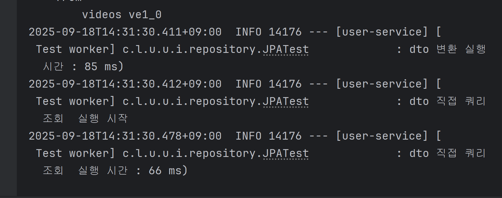

# jpa 실전 및 성능 최적화

## entity를 response로 바로 반환하면 안되는 이유는?
양방향 관계의 entity를 반환하면 참조로 인해 무한 로딩이 발생한다.

### 해결방법
이를 해결하기 위해 안좋은 방법으로는 @jsonignore,하이버네이트 모듈 를 사용하는 방법과
적절한 방법으로 dto로 치환하는 방법이 있다.
entity를 dto로 치환하는 방법을 사용하자.

## 쿼리로 dto로 직접 조회
장점 
- dto 변환 작업의 생략으로 성능이 좋다.(미비)

단점
- 쿼리문에 dto 패키지명까지 작성해야함으로 코드가 복잡해진다.
- 최적화 하기가 어렵다.
- dto로 바로 조회하기 때문에 재사용성이 떨어진다.

## entity를 dto로 변환
장점
- 재사용성이 좋다.
- 실전에서 많이 쓰이고 
단점
- 성능이 쿼리로 dto 조회보단 좋지 않다.

## jpa dto 정리
쿼리로 dto를 바로 조회보단 dto 변환을 이용하자.
성능이 정말로 중요하면 복잡한 쿼리를 사용하는 repository를 하나 만들어서 사용하자.

## JPA distinct
- JPA distinct는 sql에 distinct + 같은 엔티티를 기준으로 중복을 제거합니다.
- 일대다 관계에서 fetch join 시 엔티티가 중복된 row 행들을 jpa distinct를 이용해서 해결할 수 있다.
- db의 distinct와 다르게 모든 속성들이 다 같아야 되는게 아니라 entity가 같은 행들을 제거한다.
- 단점
  - 페이징 쿼리(getFirst 등 페이징 쿼리와 관련된 함수를 포함)와 같이 쓰지 못한다. (limit와 offset이 적용 x)
  - 페이징이 안되는 이유는?
    - collection fetch join과 페이징 쿼리가 들어가면 메모리에서 정렬을 해버립니다.(데이터 많으면 out of memory 발생)
    - 일대다라서 데이터가 뻥튀기됩니다. 그래서 엔티티 기준으로 페이징이 불가능하다

## JPA 페이징 해결법 (1,2,3 다 적용)
1. ToOne 관계에서는 fetch join을 때리자. 데이터가 join 시 뻥튀기 되지 않는다.
2. ToMany와 같은 컬렉션들을 가져올 때는 지연로딩으로 가져온다. 
3. 지연 로딩을 최적화 하기 위해 hibernate.default.batch_fetch_size, @BatchSize 을 적용한다.
- hibernate.default_batch_fetch_size : 글로 벌 설정
- @BatchSize(size = 100) : 개별 최적화 (컬렉션은 entity 필드 위에 적용 가능 , 컬렉션이 아닌 엔티티는 엔티티 클래스에 적용)
- 이 옵션은 컬렉션이나 프록시 객체를 한번에 설정한 size 만큼 in쿼리로 조회한다.

- 장점
  - 쿼리 호출 수 가 1+N -> 1+1로 최적화된다.
  - deck과 card를 조인하면 deck 가 card의 개수만큼 중복되서 조회된다. 
    - 위의 방법을 통해 중복 데이터를 제거할 수 있어 패치 조인 방식과 비교해서 쿼리 호출 수가 약간 증가하지만,DB데이터 전송량이 감소한다.
  - 컬렉션 페치 조인은 페이징이 불가능 하지만 이 방법은 페이징이 가능하다.

- 결론
ToOne 관계는 페이징에 영향을 주지 않기 때문에 ToOne 관계는 페치 조인으로 쿼리 수를 줄여 해결하고,
나머지는 hibernate.default_batch_fetch_size(1000개가 max)로 최적화 하자.
join in을 사용하기 떄문에 100 ~ 1000 사이즈를 추천한다.
1000개로 한다면 db와 어플리케이션의 부하가 높고, 100개로 하면 시간이 오래걸리기 때문에 어플리케이션이 잘 버틴다면 1000개를 하는 식으로 상황에 알맞게 선택하자.

- 권장 순서
1.  entity 조회 -> dto로 변환
2. fetch join 
3. 페이징 필요시 default_fetch.batch.size 사용
4. dto 로 조회
5. 모든 데이터 한꺼번에 가져와서 애플리케이션에서 수정(1한번의 쿼리)

## OSIV (Open Session in view)
osiv가 default가 true이기 때문에 영속성 컨텍스트의 범위가 controller, filter 까지로 적용되어 있다.
그로 인해, controller에서 지연로딩으로 가져오는 프록시 객체들을 가져올 수 있다.

OSIV를 끈다면, @Transaction이 시작할 때와 함수가 종료될때까지 영속성 컨텍스트의 범위이다.
또한, 컨트롤러에서 지연로딩으로 연관된 객체들을 가져올 때 colud not initalize proxy 에러가 터진다.

## OSIV 사용법 (해결법)
osiv를 끄는 방법과 끄지않는 방법을 선택해야된다. 
아래 내용은 끄는 방법을 택하여 사용하는 방법에 대해 설명한다.

**성능이 중요할 때 실시간 트래픽이 많고 사용자가 많을 경우 OSIV를 꺼라 **
데이터베이스 커넥션이 말라버릴 수 있다.
ADMIN 같은 경우 트래픽이 적기 떄문에 OSIV를 켜도 상관없다. 

따라서, 성능이 중요할 경우에는 OSIV를 끄면된다.

- jpa:
  open-in-view: false
1. 별도의 쿼리 서비스를 만들자.
  - 트랜잭션이 끝나기 전에 service에서 지연로딩을 호출하면 된다. (지연 로딩 및 dto 반환 작업을 모두 service에서 처리)
  - 커맨드와 쿼리를 분리해라 (핵심 비지니스 로직과 화면에 api에 맞춘 서비스를 두개 만들어라)

OSIV 단점
- 영속성 컨텍스트 범위가 넓어 데이터베이스 커넥션을 길게 가지고 있어 다양한 문제점이 발생할 수 있다.

